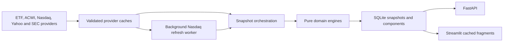

# Nasdaq-100 Analytics

Nasdaq-100 Analytics is a local research application for inspecting how the
Nasdaq-100 is weighted, how far those weights are from capitalization-based
references, how the index differs from the S&P 500, and what a public-data
simulation of the next annual reconstitution would produce.

The project has evolved beyond a single distortion score. It now combines three
connected analytical views:

1. **NDX Distortion Index** - compares published Nasdaq-100 ETF weights with a
   free-float or total-capitalization counterfactual.
2. **NDX vs S&P 500** - measures and decomposes security-level Active Share
   between matching iShares ETF proxies.
3. **Annual Reconstitution** - audits the modified-market-cap calculation,
   concentration triggers, capping transfers, rank preservation, and simulated
   membership changes.

The application is built in Python with Streamlit, FastAPI, pandas, Plotly, and
SQLite. Calculation engines are isolated from providers, persistence, and UI
code. Persistent provider caches and a background refresh worker keep the main
dashboard usable when public Nasdaq or Yahoo Finance endpoints are slow.

> This is an independent public-data research tool. It is not affiliated with
> Nasdaq, BlackRock, Invesco, MSCI, S&P Global, or the SEC, and it does not
> reproduce an official index review.

## What the application shows

### NDX Distortion Index

The main panel compares the published weights of a Nasdaq-100 ETF proxy with
the weights the same covered securities would receive under an uncapped
capitalization reference.

It includes:

- the live `NDX_WDI` and its plain-English interpretation;
- a quarterly historical series beginning with SEC N-PORT data from 2019;
- the largest current overweights and underweights;
- current constituent weights overlaid with their counterfactual weights;
- free-float and total-capitalization modes;
- Non-UCITS and UCITS fund universes;
- a simulated annual-reconstitution score and optional simulated weights;
- constituent-level sources, coverage, fallbacks, exclusions, and audit data.

The score is:

```text
weight_delta_i = published_weight_i - counterfactual_weight_i
NDX_WDI = 50 x sum(abs(weight_delta_i))
```

An `NDX_WDI` of 24 means that 24% of the index weight would need to be
reallocated for the two normalized distributions to match.

### NDX vs S&P 500

The Active Share panel compares the selected Nasdaq-100 proxy with the matching
iShares S&P 500 proxy:

| Universe | Nasdaq-100 proxy | S&P 500 proxy |
| --- | --- | --- |
| Non-UCITS | IQQ, with QQQ fallback | IVV |
| UCITS | CNDX, with EQQQ fallback | CSPX |

The calculation uses the complete union of securities in both normalized
portfolios:

```text
active_share = 50 x sum(abs(NDX_weight_i - SPX_weight_i))
```

The panel includes:

- the ten largest NDX overweights and S&P 500 overweights;
- a Top-X concentration comparison;
- a security-level overlay of NDX and S&P 500 weights;
- synthetic 100% portfolios for NDX-only active weight, S&P-only active weight,
  and portfolio overlap;
- expandable holding tables;
- an optional annual-reconstitution scenario for the NDX side.

Active Share measures composition and weight differences. It is not a return,
tracking-error, risk, or performance forecast.

### Annual Reconstitution

The annual panel exposes the intermediate stages of the public-data Nasdaq-100
simulation rather than showing only its final weights.

It visualizes:

- selected-company modified market capitalizations;
- the 3x free-float ceiling;
- company and security concentration thresholds;
- the company cohort above 4.5% and its cumulative weight;
- weight transferred by company and security capping;
- the largest donors and recipients;
- rank preservation at each capping stage;
- current versus simulated weights;
- simulated index additions and removals.

An audit section exposes the reconstructed values and residuals behind the
charts.

## Data model and universes

Two regulatory universes are calculated and stored independently:

- `non_ucits`
- `ucits`

They are never merged or averaged. Each distortion snapshot is also stored
under one capitalization basis:

- `float`
- `total`

Switching a dashboard control selects another persisted snapshot. It does not
reinterpret or mix data from a different universe or basis.

Published ETF holdings are always used as reported by the selected fund. The
application removes cash and explicit non-equity positions, consolidates
duplicate rows by ticker, and normalizes the remaining positive equity weights
to 100%. GOOG and GOOGL remain separate securities.

## Live distortion methodology

### Free-float reference

The primary free-float reference is the official iShares ACWI holdings file.
The application uses each matched holding's market value, not its rounded
displayed weight:

```text
reference_mass_i = ACWI_holding_market_value_i
float_weight_i = reference_mass_i / sum(reference_mass)
```

Matching uses ticker and company-name checks to avoid collisions between
unrelated listings with the same symbol.

ADR/ADS securities deliberately bypass direct ACWI matching because ACWI may
hold the issuer's primary listing rather than the US depositary receipt.
Current defaults are `ARM`, `ASML`, and `PDD`; `NDX_ADR_TICKERS` can extend the
list.

For an ADR or a security absent from ACWI, Yahoo Finance free-float
capitalization is converted into the same ACWI fund-value scale:

```text
fallback_scale =
    median(ACWI_market_value / yfinance_float_market_cap)

fallback_reference_mass =
    yfinance_float_market_cap x fallback_scale
```

ACWI matches and calibrated fallbacks are combined first and then normalized
together to 100%. Fallback observations are never normalized as a separate
portfolio.

The Nasdaq-listed ASML receipt has a maintained override of `88,000,000` for
both floating and total listed receipts. This avoids using Yahoo Finance's
consolidated issuer-level value and prevents the annual calculation from
deriving an unsupported 3x float ratio for the ADR.

### Total-capitalization reference

The total mode uses listed shares outstanding:

```text
total_market_cap_i = price_i x shares_outstanding_i
total_weight_i = total_market_cap_i / sum(total_market_cap)
```

This is an analytical comparison scenario, not a claim that Nasdaq uses a
simple uncapped total-market-cap methodology.

### Coverage and validation

The score is calculated over securities with a valid reference. Published and
counterfactual weights are each renormalized over that same covered set.

`coverage_ratio` reports the original published ETF weight represented before
renormalization. With the default `NDX_COVERAGE_THRESHOLD=0.99`:

- `complete` means at least 99% coverage;
- `partial_coverage` means coverage is below the threshold;
- `degraded_fallback` and `degraded_partial_coverage` identify an all-Yahoo
  fallback when ACWI cannot be validated.

Invalid float observations are excluded rather than silently repaired. The
quality checks reject impossible or inconsistent combinations of price, float
shares, total shares, and market capitalization.

## Annual reconstitution simulation

Every live snapshot can simulate a full annual December reconstitution using
the snapshot date's public inputs. This is not an accelerated or forced
rebalancing scenario: it asks what the annual process would produce if today's
data were the annual reference data.

The implementation follows the public Nasdaq-100 methodology and index weight
calculation rules:

- [Nasdaq-100 Index methodology](https://indexes.nasdaqomx.com/docs/Methodology_NDX.pdf)
- [Nasdaq index weight calculations](https://indexes.nasdaqomx.com/docs/Nasdaq_Index_Weight_Calculations.pdf)

The pipeline:

1. Builds a public eligible universe from Nasdaq sources.
2. Applies listing, issuer, security-type, seasoning, and liquidity filters.
3. Groups multiple security classes at company level, using SEC CIK identifiers
   when available.
4. Applies the annual top-75/100/125 constituent-selection sequence.
5. Recalculates initial security weights from modified market capitalization.
6. Applies company-level concentration rules while preserving initial rank.
7. Returns to security level and applies security-level concentration rules.
8. Converts final weights into proportional simulated Index Shares.
9. Recalculates distortion and Active Share with the simulated NDX weights.

For direct ACWI matches, modified market capitalization uses ACWI free-float
mass rather than Yahoo Finance `floatShares`:

```text
acwi_conversion_scale =
    90th percentile(ACWI_float_mass / listed_total_cap)

converted_total_mass = listed_total_cap x acwi_conversion_scale
modified_cap_mass = min(converted_total_mass, 3 x ACWI_float_mass)
```

The annual capping engine implements these public constraints:

- a company above 24% is adjusted to at most 20%;
- if companies above 4.5% represent at least 48%, that cohort is reduced to
  40%;
- a security above 15% is adjusted to at most 14%;
- if the five largest securities represent at least 40%, they are reduced to
  38.5%;
- securities outside that top five are then capped at the lower of 4.4% or the
  fifth-largest security weight.

The constraints are iterated until satisfied. Company-stage and security-stage
rank preservation are measured independently.

Nasdaq does not publish every review input and retains methodological
discretion. The resulting composition is therefore a transparent public-data
simulation, not a forecast of an official review. When a fresh public universe
is unavailable, the foreground calculation uses a compatible cached selection
or current constituents while a background worker attempts to refresh the
selection.

## Quarterly history

The long-term WDI chart does not use frequent local refresh snapshots. It uses
one observation per public quarter, beginning in September 2019.

The historical methodology is separate from the live ACWI methodology:

1. Discover QQQ and SPGM Form N-PORT-P filings in SEC EDGAR.
2. Download and archive the complete filing XML.
3. Match equity positions by exact CUSIP.
4. Exclude missing ADRs and incompatible listing forms from both sides.
5. Estimate other missing SPGM positions with the median observed overweight
   ratio for that quarter.
6. Normalize QQQ and the reconstructed SPGM comparison to 100%.
7. Calculate raw and corrected quarterly WDI values.

The correction was selected through historical masking tests. The raw matched
score, estimated positions, exclusions, correction size, and constituent-level
contributions remain available for audit.

Rebuild the complete local archive with:

```bash
python run_quarterly_history.py
```

Generated files include:

```text
data/
  edgar_quarterly_history.csv
  sec_nport_filings/
    manifest.csv
    positions.csv.gz
    constituent_history.csv.gz
    raw/
      qqq/
      spgm/
```

The filing archive is ignored by Git. SEC requests should set a descriptive
`SEC_USER_AGENT`. A configured reader transport can retrieve the same official
SEC document when direct archive access is blocked; the manifest records the
transport, source URL, checksum, and local path.

## Data sources and fallback order

Each holdings source must contain a plausible complete equity portfolio:
90-130 securities for Nasdaq-100 proxies, unique normalized tickers, and valid
positive weights. HTML pages, top-holdings extracts, and incomplete exports are
rejected.

### Nasdaq-100 ETF holdings

Non-UCITS:

1. `NON_UCITS_HOLDINGS_CSV` or `--holdings-csv`
2. official iShares IQQ download
3. public Invesco QQQ download
4. `NON_UCITS_FALLBACK_URLS`

UCITS:

1. `UCITS_HOLDINGS_CSV` or `--holdings-csv`
2. official iShares CNDX download
3. public Invesco EQQQ download
4. `UCITS_FALLBACK_URLS`

### S&P 500 ETF holdings

- Non-UCITS: local override or official iShares IVV
- UCITS: local override or official iShares CSPX

### Other providers

- ACWI: official BlackRock/iShares holdings download
- prices and listed share data: Yahoo Finance through `yfinance`
- public Nasdaq universe and liquidity: Nasdaq public endpoints and symbol
  directory
- issuer identity: SEC CIK data where available
- quarterly history: SEC EDGAR Form N-PORT-P filings for QQQ and SPGM

There is no synthetic snapshot fallback. A provider failure either uses a
previously validated cached result, uses an explicitly documented degraded
method, or fails visibly.

## Architecture

```text
dashboard.py                 Streamlit application and panel composition
api.py                       FastAPI read and recompute endpoints
run_snapshot.py              one-off and scheduled snapshot CLI
run_local.py                 detached local API/dashboard launcher
run_quarterly_history.py     SEC history rebuild entry point

snapshot_service.py          live orchestration and persistence boundary
database.py                  SQLite snapshot and component repository
provider_cache.py            persistent provider, market, selection, and job cache
cached_providers.py          stale-while-revalidate provider wrappers
background_jobs.py           deduplicated single-worker refresh queue
observability.py             stage timings and cache-status events

qqq_holdings_provider.py     Nasdaq-100 and S&P 500 holdings adapters
acwi_weights_provider.py     ACWI matching and calibrated fallbacks
market_data_provider.py      batched and cached yfinance adapter
nasdaq100_rebalance.py       Nasdaq/Yahoo I/O adapter for reconstitution
edgar_quarterly_history.py   SEC archive and quarterly reconstruction

ndx_wdi/
  domain/
    active_share.py          pure Active Share calculations
    distortion.py            pure WDI and coverage calculations
    market_quality.py        shared market-data validation
    rebalance.py             pure selection and capping rules
    rebalance_analytics.py   threshold, transfer, and rank analysis
  ui/
    runtime.py               snapshot-scoped Streamlit caches

dashboard_chart_data.py      deterministic chart-data transformations
tests/                       unit, integration, persistence, API, and boundary tests
```

Root-level `active_share.py`, `distortion_engine.py`, and
`rebalance_analytics.py` remain compatibility facades. New application code
imports the pure engines from `ndx_wdi.domain`.

The domain package is deliberately prevented from importing network, database,
or UI modules. This keeps the financial rules deterministic and testable while
allowing providers or the frontend to be replaced independently.

### Runtime data flow



## Cache and refresh behavior

The application uses two different cache layers:

1. **Persistent provider cache** in `data/provider_cache.sqlite3`
2. **Snapshot-scoped Streamlit cache** keyed by immutable `snapshot_id`

Default provider lifetimes:

| Data | Default TTL |
| --- | ---: |
| ETF and ACWI parsed holdings | 6 hours |
| Current prices | 10 minutes |
| Float shares, total shares, market cap | 24 hours |
| Nasdaq public universe and liquidity | 24 hours |
| Annual constituent selection | 24 hours |
| Retry delay after failed fundamentals request | 60 seconds |

Provider holdings use stale-while-revalidate behavior: a failed refresh retains
the last complete validated portfolio. Cache keys include provider order and
configured URLs, so configuration changes do not reuse incompatible data.
Explicit local CSV inputs bypass the fund cache.

Nasdaq universe and liquidity retrieval never blocks the main snapshot. The
foreground uses a fresh or stale compatible selection when available, otherwise
current constituents. A deduplicated single-worker queue refreshes the slow
inputs and can persist a later updated snapshot.

Each dashboard analysis panel is an isolated Streamlit fragment. Widget changes
inside one panel do not rerun the header, reload unrelated panels, or create a
new snapshot. Component tables, Active Share results, annual analysis, chart
inputs, and quarterly history are cached by snapshot or source-file identity.

Every completed refresh records:

- `performance_status`
- stage-level `timings_ms`
- source-specific `cache_statuses`
- structured completion or failure events

`NDX_REFRESH_WARN_SECONDS` marks a completed refresh as `slow` without failing
it.

## Installation

Python 3.11 or 3.12 is recommended.

### Windows PowerShell

```powershell
python -m venv .venv
.\.venv\Scripts\Activate.ps1
python -m pip install --upgrade pip
pip install -r requirements.txt
pip install -r requirements-dev.txt
Copy-Item .env.example .env
```

### macOS and Linux

```bash
python -m venv .venv
source .venv/bin/activate
python -m pip install --upgrade pip
pip install -r requirements.txt
pip install -r requirements-dev.txt
cp .env.example .env
```

`requirements.txt` is the reproducible lock file. Direct dependency ranges live
in `requirements.in`.

## Quick start

Create the initial snapshots:

```bash
python run_snapshot.py --universe all
```

Launch the API and dashboard:

```bash
python run_local.py
```

`run_local.py` returns immediately, skips a service whose port is already in
use, and writes process output under `data/`.

- Dashboard: `http://127.0.0.1:8501`
- API documentation: `http://127.0.0.1:8000/docs`

To run the services interactively:

```bash
python -m uvicorn api:app --host 127.0.0.1 --port 8000
python -m streamlit run dashboard.py --server.address 127.0.0.1 --server.port 8501
```

Run those commands in separate terminals.

## Snapshot commands

```bash
# Both universes, free-float reference
python run_snapshot.py --universe all

# Both universes, total-capitalization reference
python run_snapshot.py --universe all --basis total

# One universe with an explicit local holdings file
python run_snapshot.py --universe non_ucits --holdings-csv path/holdings.csv

# Built-in daily loop at local time
python run_snapshot.py --universe all --daily --at 18:00
```

For unattended production use, prefer Task Scheduler, cron, or another service
manager around the one-off command.

## Configuration

Copy `.env.example` to `.env`. The example file documents every supported
provider URL, local override, cache path, timeout, TTL, and SEC option.

The most important settings are:

| Variable | Purpose |
| --- | --- |
| `NDX_DB_PATH` | Snapshot SQLite database |
| `NDX_PROVIDER_CACHE_PATH` | Persistent provider cache |
| `NDX_COVERAGE_THRESHOLD` | Minimum complete-snapshot coverage |
| `NDX_REFRESH_WARN_SECONDS` | Slow-refresh warning threshold |
| `NDX_BACKGROUND_REFRESH_ENABLED` | Enable background Nasdaq refresh |
| `NDX_ADR_TICKERS` | Additional ADR/ADS symbols |
| `NON_UCITS_HOLDINGS_CSV` | Local Non-UCITS Nasdaq-100 holdings |
| `UCITS_HOLDINGS_CSV` | Local UCITS Nasdaq-100 holdings |
| `NON_UCITS_SPX_HOLDINGS_CSV` | Local Non-UCITS S&P 500 holdings |
| `UCITS_SPX_HOLDINGS_CSV` | Local UCITS S&P 500 holdings |
| `YFINANCE_PRICE_TTL_SECONDS` | Price cache lifetime |
| `YFINANCE_FUNDAMENTALS_TTL_SECONDS` | Share-data cache lifetime |
| `PROVIDER_HOLDINGS_TTL_SECONDS` | Parsed fund holdings lifetime |
| `NASDAQ_SELECTION_TTL_SECONDS` | Annual selection lifetime |
| `SEC_USER_AGENT` | SEC-compliant application identity |

## API

| Method | Route | Purpose |
| --- | --- | --- |
| `GET` | `/api/current` | Latest snapshot by universe and basis |
| `GET` | `/api/history` | Persisted local snapshot history |
| `GET` | `/api/components` | Constituent-level WDI data |
| `GET` | `/api/active-share` | Active Share summary and components |
| `POST` | `/api/recompute` | Run and persist a live recomputation |

Examples:

```bash
curl "http://127.0.0.1:8000/api/current?universe=non_ucits&weighting_basis=float"

curl "http://127.0.0.1:8000/api/components?universe=ucits&ranking=contributors&limit=20"

curl "http://127.0.0.1:8000/api/active-share?universe=non_ucits&rebalanced=true"

curl -X POST "http://127.0.0.1:8000/api/recompute" \
  -H "Content-Type: application/json" \
  -d '{"universe":"all","weighting_basis":"float"}'
```

Component rankings:

- WDI: `all`, `overweights`, `underweights`, `contributors`
- Active Share: `all`, `ndx_overweights`, `spx_overweights`, `contributors`

## Persistence

The main SQLite database stores:

- snapshot summary, status, basis, universe, sources, and dates;
- WDI component weights and contributions;
- annual simulated weights, membership, changes, and input status;
- Active Share summaries and security-level comparisons;
- refresh timings and cache statuses.

The provider-cache SQLite database stores:

- batched market data;
- parsed holdings frames;
- annual Nasdaq selections;
- durable background-refresh job state.

Local snapshot history begins when the first snapshot is saved. It is distinct
from the SEC quarterly history used by the long-term chart.

## Development and validation

```bash
python -m ruff check .
python -m pytest
```

The test suite covers:

- normalization and WDI arithmetic;
- Active Share and synthetic sleeves;
- market-data quality rules;
- annual selection, capping, transfers, and rank preservation;
- ETF and ACWI parsing and validation;
- persistent caches and background jobs;
- SQLite migrations and persistence;
- API routes and recomputation;
- Streamlit runtime cache behavior;
- SEC filing parsing and quarterly reconstruction;
- architectural boundaries between domain and infrastructure.

GitHub Actions runs Ruff, compilation, and the full suite on Python 3.11 and
3.12 for every pull request.

## Known limitations

- ETF holdings are investable proxies for index weights, not official Nasdaq
  constituent files.
- Free public market-data fields can be delayed, incomplete, or inconsistent.
- ACWI can represent a primary listing rather than the Nasdaq-listed receipt.
- The annual composition simulation lacks non-public Nasdaq review flags and
  discretionary decisions.
- Current membership is used conservatively when a compatible annual-selection
  cache is unavailable.
- Historical SPGM coverage is incomplete in early quarters and requires the
  documented correction method.
- Local live history only exists from the first successful saved snapshot.

These limitations are retained in snapshot statuses, source fields, component
statuses, rebalance notes, and audit tables rather than hidden from the UI.
